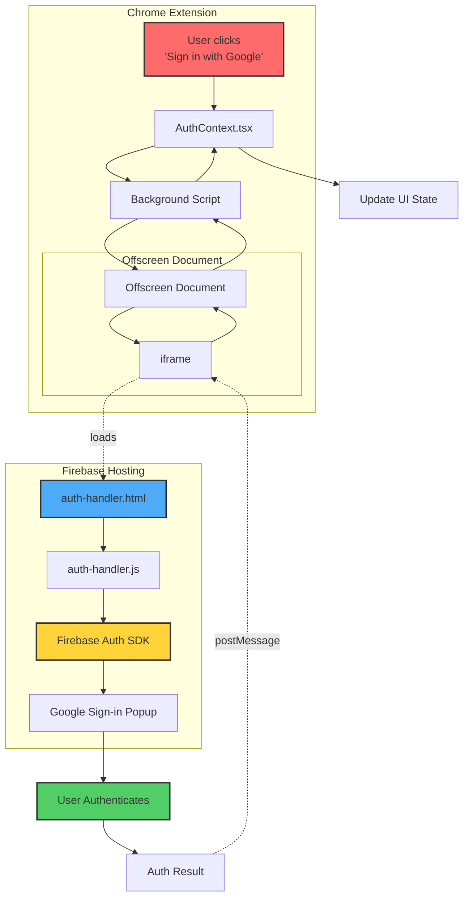
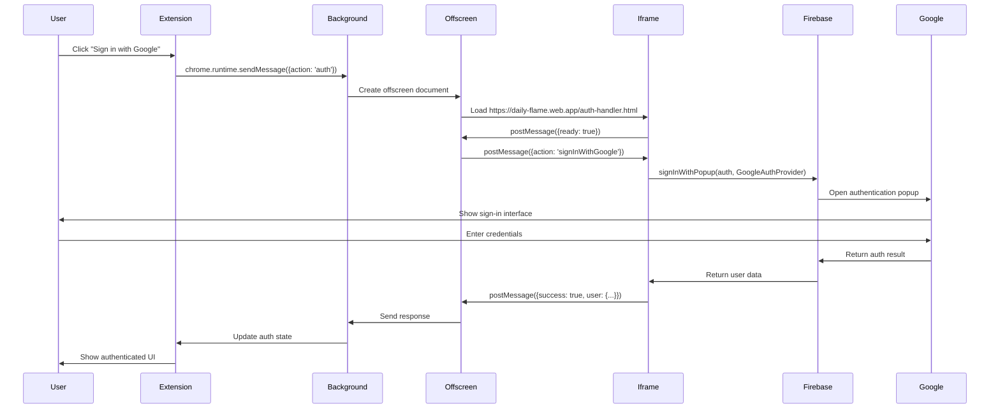

# Firebase Authentication Solution for Chrome Extension (Manifest V3)

## Problem Summary

The Chrome extension was encountering a `Firebase: Error (auth/internal-error)` when attempting to use `signInWithPopup` for Google authentication. This error occurred because:

1. **Content Security Policy (CSP) Restrictions**: Manifest V3 prohibits loading external scripts
2. **Firebase Auth Requirements**: `signInWithPopup` needs to load Google's authentication scripts (`https://apis.google.com/js/api.js`)
3. **Context Limitations**: Even with offscreen documents, the extension context still enforces CSP restrictions

## The Solution: Firebase Hosting + Iframe Architecture

We solved this by hosting an authentication handler on Firebase Hosting and loading it in an iframe within the offscreen document. This approach bypasses CSP restrictions because the hosted page runs in a standard web context, not the extension context.

## Architecture Diagram



## Data Flow Sequence



## Key Components

### 1. **Hosted Authentication Handler** (`auth-handler.html` + `auth-handler.js`)
- **Location**: https://daily-flame.web.app/auth-handler.html
- **Purpose**: Runs in standard web context without CSP restrictions
- **Features**:
  - Loads Firebase SDK from Google's CDN
  - Handles all authentication methods (Google, Email/Password)
  - Communicates via postMessage API

### 2. **Offscreen Document** (`offscreen.ts`)
- **Purpose**: Bridge between extension and hosted page
- **Key Functions**:
  - Creates hidden iframe pointing to hosted auth handler
  - Proxies messages between background script and iframe
  - Manages authentication state

### 3. **Message Flow**
```javascript
// 1. Extension initiates auth
chrome.runtime.sendMessage({
  action: 'auth',
  authAction: 'signInWithGoogle'
});

// 2. Background script forwards to offscreen
chrome.runtime.sendMessage({
  target: 'offscreen-auth',
  action: 'signInWithGoogle'
});

// 3. Offscreen sends to iframe
iframe.contentWindow.postMessage({
  action: 'signInWithGoogle'
}, 'https://daily-flame.web.app');

// 4. Iframe handles auth and responds
window.parent.postMessage({
  success: true,
  user: { uid, email, displayName, ... }
}, extensionOrigin);
```

## Why This Solution Works

### ✅ **Bypasses CSP Restrictions**
- The hosted page runs in a standard web context
- Can load any external scripts (Google APIs, Firebase SDK)
- No Manifest V3 restrictions apply

### ✅ **Maintains Security**
- Authentication happens on your controlled Firebase Hosting domain
- Cross-origin communication secured via postMessage origin checks
- Extension ID must be added to Firebase authorized domains

### ✅ **Follows Firebase Best Practices**
- This is Firebase's officially documented solution
- Quote from Firebase docs: *"This technique requires you to set up a web page that is available on the web, that you will load in an iframe."*

### ✅ **Supports All Auth Methods**
- Google Sign-in with Popup
- Email/Password authentication
- Any future OAuth providers

## Configuration Requirements

1. **Firebase Console**:
   - Add `chrome-extension://YOUR_EXTENSION_ID` to authorized domains
   - Enable authentication providers (Google, Email/Password)

2. **Firebase Hosting**:
   - Hosts the authentication handler files
   - CORS headers configured to allow cross-origin requests

3. **Extension Permissions**:
   ```json
   {
     "permissions": ["offscreen"],
     "host_permissions": ["https://daily-flame.web.app/*"]
   }
   ```

## Error Resolution

The original error:
```
Firebase: Error (auth/internal-error)
```

Was caused by the extension trying to load:
```
https://apis.google.com/js/api.js
```

Which violated the CSP directive:
```
script-src 'self'
```

By moving authentication to a hosted page, we completely avoid this restriction while maintaining a secure authentication flow.

## Summary

This solution leverages Firebase Hosting to create a "authentication proxy" that handles Firebase Auth operations in a standard web context, then communicates results back to the extension via secure postMessage channels. This approach is:

- ✅ **Official**: Recommended by Firebase documentation
- ✅ **Secure**: Uses origin validation and authorized domains
- ✅ **Reliable**: Works with all authentication methods
- ✅ **Future-proof**: Compatible with Manifest V3 and beyond