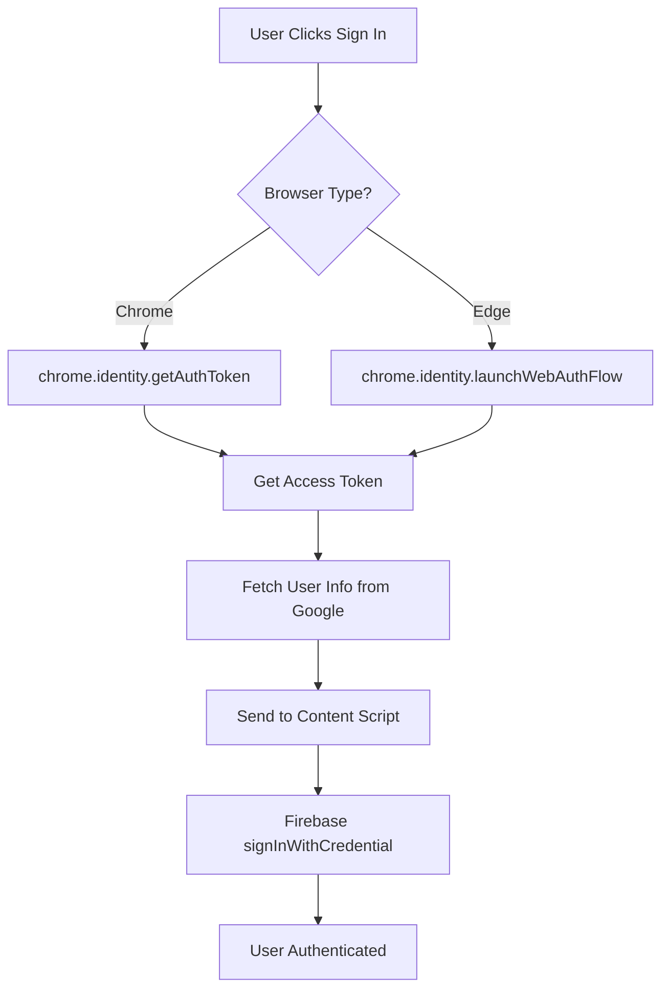

# OAuth Security Analysis - Daily Flame Chrome Extension

## Executive Summary

This document provides a comprehensive security analysis of the Daily Flame Chrome Extension's OAuth implementation, focusing on Google Sign-In integration, security best practices, and user experience improvements.

---

## 🔍 Current Implementation Review

### Strengths

1. **Chrome Identity API Integration**
   - ✅ Uses `chrome.identity.getAuthToken()` for secure OAuth flow
   - ✅ Fallback to `launchWebAuthFlow()` for Edge compatibility
   - ✅ Forces account selection with `account: { id: 'any' }`

2. **Firebase Authentication**
   - ✅ Proper integration with Firebase Auth
   - ✅ User state management via `onAuthStateChanged`
   - ✅ Token management handled by Firebase SDK

3. **Security Features**
   - ✅ Email verification enforcement (except admin accounts)
   - ✅ Secure token exchange through Chrome APIs
   - ✅ No client-side storage of sensitive credentials

### Current Flow Analysis



---

## 🛡️ Security Improvements

### 2. **Security Headers (CSP)**
Security headers protect against various attacks:

```javascript
// manifest.json - Current CSP
"content_security_policy": {
  "extension_pages": "script-src 'self'; object-src 'self'"
}
```

**Recommended additions:**
```javascript
"content_security_policy": {
  "extension_pages": "script-src 'self'; object-src 'none'; style-src 'self' 'unsafe-inline'; img-src 'self' https://*.googleusercontent.com data:; connect-src 'self' https://*.googleapis.com https://*.firebaseapp.com"
}
```

### 3. **Token Security**
- ✅ Current: Tokens handled by Chrome Identity API
- ⚠️ Improvement: Add token refresh logic
- ⚠️ Improvement: Clear tokens on sign-out

### 4. **State Management Security**
```javascript
// Add to AuthContext.tsx
const clearAuthTokens = async () => {
  // Clear Chrome identity tokens
  if (chrome.identity && chrome.identity.clearAllCachedAuthTokens) {
    await chrome.identity.clearAllCachedAuthTokens();
  }
  // Clear Firebase session
  await firebaseSignOut(auth);
};
```

---

## 🚨 Common User Issues & Solutions

### Issue 1: "Sign in with Google" Not Working
**Symptoms:**
- Button clicks but nothing happens
- Popup blocked
- Silent failures

**Solutions:**
```javascript
// Add better error handling
try {
  const result = await handleGoogleSignIn();
} catch (error) {
  if (error.message.includes('User interaction required')) {
    showToast('Please allow popups for sign in', 'warning');
  } else if (error.message.includes('Network')) {
    showToast('Check your internet connection', 'error');
  } else {
    showToast('Sign in failed. Please try again.', 'error');
  }
}
```

### Issue 2: Edge Browser Compatibility
**Current Implementation:** ✅ Already handled with `launchWebAuthFlow` fallback

### Issue 3: Account Selection Loop
**Problem:** User can't switch Google accounts
**Solution:** Current implementation correctly uses `prompt: 'select_account'`

### Issue 4: Token Expiration
**Problem:** User stays signed in but API calls fail
**Solution:**
```javascript
// Add token refresh logic
const refreshToken = async () => {
  try {
    const newToken = await chrome.identity.getAuthToken({ 
      interactive: false 
    });
    return newToken;
  } catch (error) {
    // Token refresh failed, require re-authentication
    await signOut();
    throw new Error('Session expired. Please sign in again.');
  }
};
```


```

### 2. Enhanced Error Handling

```javascript
// Better error messages for users
const ERROR_MESSAGES = {
  'auth/popup-blocked': 'Please allow popups to sign in with Google',
  'auth/network-request-failed': 'Network error. Check your connection.',
  'auth/cancelled-popup-request': 'Sign in was cancelled',
  'auth/popup-closed-by-user': 'Sign in window was closed',
  'EDGE_NOT_SUPPORTED': 'Please use Chrome for the best experience',
};
```

### 3. User Experience Improvements

1. **Loading States**
   ```jsx
   // Show loading spinner during auth
   {isAuthenticating && <LoadingSpinner message="Signing you in..." />}
   ```

2. **Clear Success/Error Feedback**
   ```jsx
   // Use your toast system
   showToast('Welcome back!', 'success');
   ```

3. **Persistent Sessions**
   - Firebase already handles this
   - Consider adding "Remember me" for 30-day sessions

### 4. Privacy & Transparency

Add clear messaging about:
- What data is accessed (email, name, profile photo)
- What is stored (only authentication tokens)
- How to revoke access

---

## 🔐 About Security Headers

**What are they?**
HTTP headers that tell browsers how to behave when handling your site's content.

**Key Headers for Extensions:**
1. **Content-Security-Policy (CSP)**: Prevents XSS attacks
2. **X-Frame-Options**: Prevents clickjacking
3. **Strict-Transport-Security**: Forces HTTPS

**For Chrome Extensions:**
- Set in `manifest.json` not HTTP headers
- More restrictive than web apps
- Protects against malicious scripts

---

## 🔍 About Penetration Testing

**What is it?**
- Professional security testing
- Simulates real attacks safely
- Identifies vulnerabilities before hackers do

**Will it break your system?**
- No, it's done carefully
- Read-only testing first
- Any modifications are controlled
- You get a report of findings

**For Chrome Extensions:**
- Test OAuth flow security
- Check for token leakage
- Verify CSP effectiveness
- Test error handling

---

## ✅ Action Items

1. **Immediate:**
   - [ ] Add better error messages

2. **Short-term:**
   - [ ] Implement token refresh logic
   - [ ] Add loading states
   - [ ] Update privacy messaging

3. **Long-term:**
   - [ ] Consider OAuth 2.0 PKCE flow
   - [ ] Add analytics for auth failures
   - [ ] Regular security audits

---

## 📚 Resources

- [Chrome Identity API Docs](https://developer.chrome.com/docs/extensions/reference/identity/)
- [Firebase Auth Best Practices](https://firebase.google.com/docs/auth/web/manage-users)
- [OAuth 2.0 Security Best Practices](https://datatracker.ietf.org/doc/html/draft-ietf-oauth-security-topics)
- [Chrome Extension Security](https://developer.chrome.com/docs/extensions/mv3/security/)